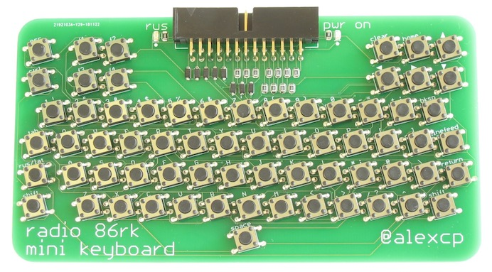

# Mini Keyboard for Radio-86RK

A mini keyboard for Radio-86RK, a 1986 DIY 8-bit home computer.

## Introduction

When I designed my [Radio-86RK-SRAM](https://github.com/mac2rk/Radio-86RK-SRAM) remake of the 1986 DIY 8-bit home computer, I built in a PS/2 keyboard adapter to stay away from homebrew keyboards and use a commercial full-size keyboard instead. I found, however, that in many cases the full size keyboard took too much space, so I designed a mini matrix keyboard built from tact momentary switches. The design was inspired by [Hackaday Belgrade 2018 conference badge](https://hackaday.com/2018/05/15/retro-computer-badge-for-hackaday-belgrade-has-everything-you-wished-for-back-in-the-day/).

Due to the large number of SMT tact buttons, it is easier to solder in an SMT over or with hot air. Normal manual soldering is quite possible, too.

## Schematic and PCB layout
[Schematic](Eagle/rk86-kbd-schematic.pdf)

[PCB layout](Eagle/rk86-kbd-silk.pdf)

## Bill of Materials

Device                | Package   | Quantity
--------------------- | --------- | -------
Tact momentary switch | 6x6mm SMT | 67
Resistor 2kOhm        | 0805      | 11
Resistor 330Ohm       | 0805      | 2
1N4148W diode         | SOD-123   | 8
LED                   | 0805      | 2
2x13 box header       | Right Angle | 1
